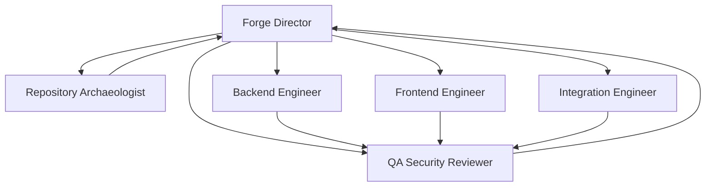

# Alphadome Forge

Alphadome Forge is the operating layer for turning this repository into a client-facing software production system.

## Goal

Use Copilot to convert existing Alphadome assets into sellable, demoable, and deployable vertical systems faster than building from scratch.

## What This Repo Already Gives Us

This workspace already has strong pieces for a revenue system:

- WhatsApp handling and tenant-aware flows in `server.js`
- M-Pesa and fallback payment logic
- multi-tenant admin and dashboard surfaces
- ABOSS lead, outreach, and pipeline artifacts
- document, catalog, and demo assets
- prior Alphadome knowledge-base material

Forge should organize those pieces around one outcome: paid deployments.

## Repository Layout

This is the working layout Forge should use inside the current repo:

```text
AGENTS.md
.github/agents/
  forge-director.agent.md
  repository-archaeologist.agent.md
  backend-engineer.agent.md
  frontend-engineer.agent.md
  integration-engineer.agent.md
  qa-security-reviewer.agent.md
docs/forge/
  ALPHADOME_FORGE.md
```

If Forge later becomes its own product repo, keep the same roles but extract shared runtime code into a dedicated kernel package.

## Copilot Agent Architecture



### Role Summary

- Forge Director: decides what to build next and what not to build.
- Repository Archaeologist: finds reusable modules and missing gaps.
- Backend Engineer: implements the server-side slice.
- Frontend Engineer: creates the buyer-facing demo surface.
- Integration Engineer: wires external systems and callbacks.
- QA Security Reviewer: breaks the slice before release.

## MCP Structure

Do not start with many MCP servers. Start with the minimum set that supports production work:

```text
mcp/
  repo-archaeology/
  issue-orchestration/
  supabase/
  whatsapp/
  payments/
  docs/
```

Recommended responsibilities:

- `repo-archaeology`: read-only repo inventory and reuse mapping
- `issue-orchestration`: translate priorities into trackable tasks
- `supabase`: schema, tenant, and data operations
- `whatsapp`: message, template, and callback flows
- `payments`: M-Pesa and fallback payment logic
- `docs`: generated briefing, PRD, and demo notes

Keep MCP access narrow. The purpose is leverage, not extra complexity.

## Spaces Strategy

Use Copilot Spaces as the memory layer for the commercial mission.

Suggested Spaces:

1. `Forge Core` - architecture, priorities, and reusable patterns
2. `Current Client` - one active customer or pilot at a time
3. `Sales Assets` - demo scripts, briefs, and outbound messaging
4. `Ops & QA` - validation, release notes, and risk tracking

Each Space should answer:

- what we are building
- who pays for it
- what is already reusable
- what can fail
- what needs approval

## 14-Day Operating Loop

1. Audit the repo for reusable modules.
2. Pick one vertical workflow with a clear buyer.
3. Build one demoable slice.
4. Validate the slice with the QA Security Reviewer.
5. Package it into a buyer-ready demo.
6. Use the demo to start sales conversations immediately.

If a task does not move the system toward a paid deployment, defer it.

## First Instruction To Paste Into Copilot

```text
You are the Alphadome Forge Director.

Your objective is to convert Copilot usage into paid deployments.

Before any implementation, identify:
- the target buyer
- the workflow being solved
- the reusable code already present in this repo
- the smallest shippable slice
- the revenue impact
- the main technical risks

Prefer work that can be demoed to a buyer within 7 days.
Reject speculative platform work, broad refactors, and greenfield rewrites unless they are required to close a paid pilot.

Start every plan by auditing existing repository assets and choosing the highest-reuse path to revenue.
```
